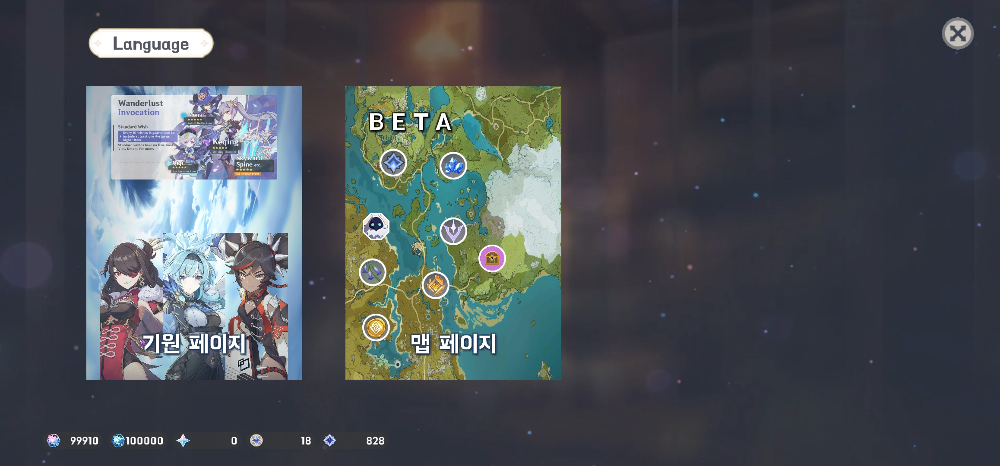
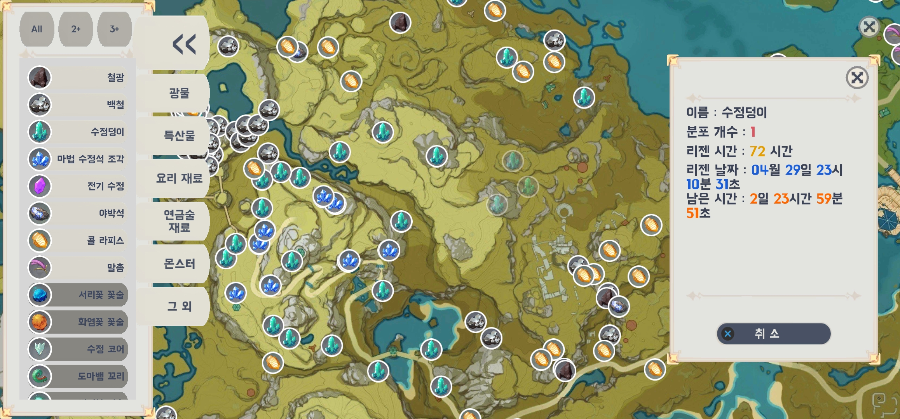
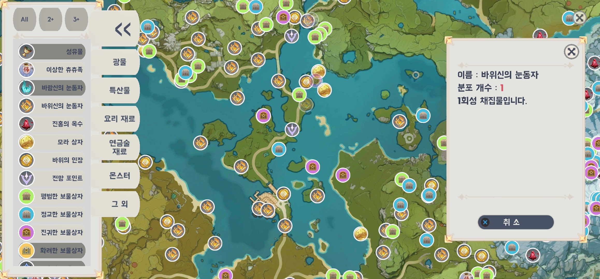
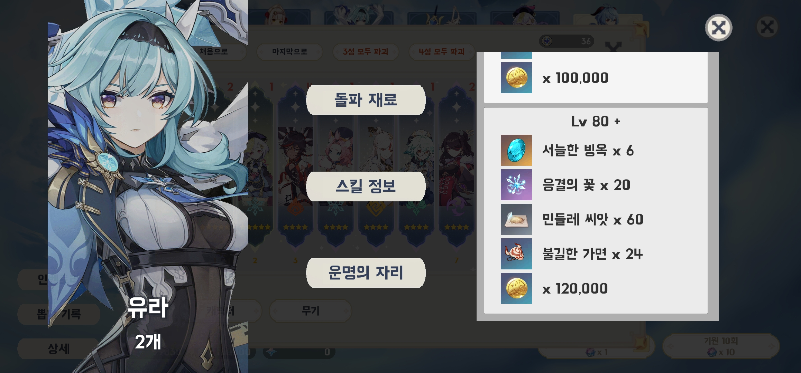
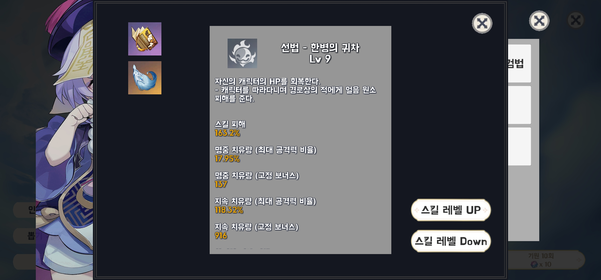
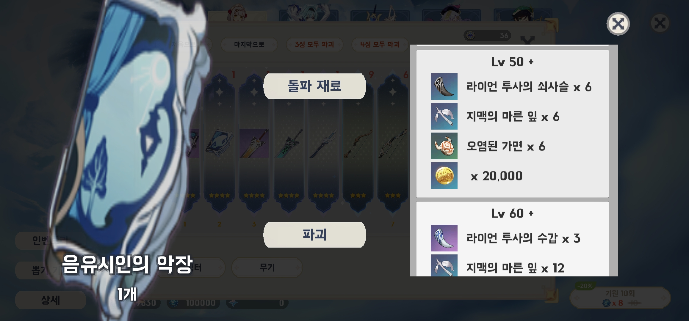
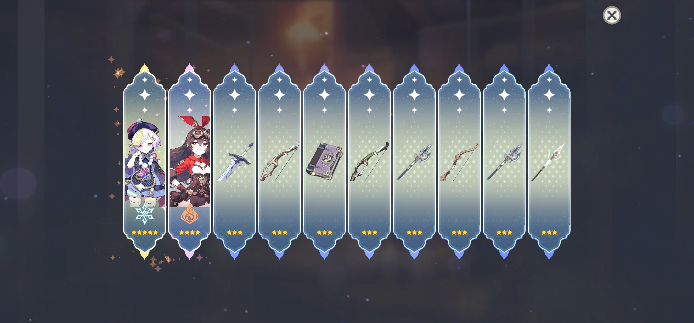

# unity-genshin-smart-simulator
- 원신 스마트 시뮬레이터를 관리하기 위한 저장소
  - 자원 & 보물상자 & 눈동자 지도, 타이머
  - 캐릭터 레벨별 스킬, 캐릭터 및 무기 돌파 재료 
  - 기원 체험
  - 성유물 점수 계산기(예정)
  - 성유물 추천, 공략(예정)

## Information

- 자원 체킹 맵

- 캐릭터 조회

- 기원

- 인게임 이미지

## Support Link
PC, Android, IOS(예정)
